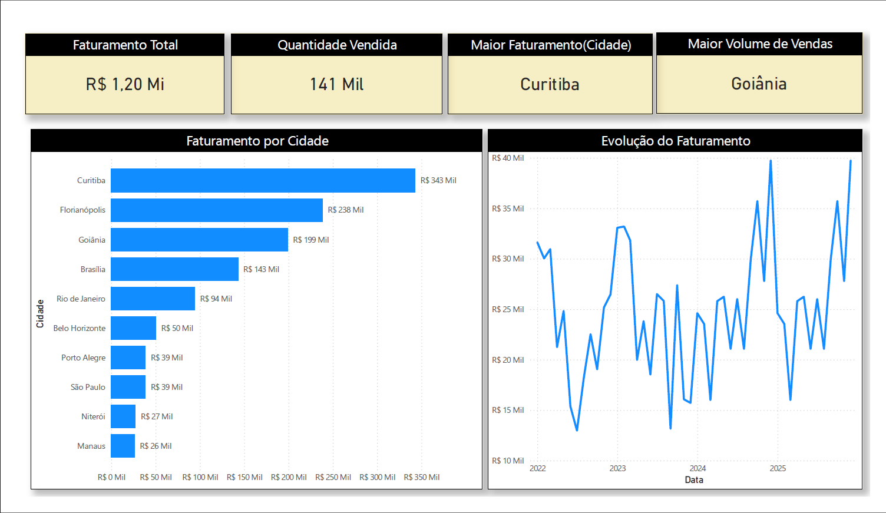

# 📊 Dashboard de Vendas no Power BI

Projeto prático de análise de vendas com foco em geração de insights para tomada de decisão.

---

## 🎯 Objetivo
Construir um dashboard interativo para análise de vendas, permitindo identificar desempenho por cidade e evolução ao longo do tempo.

---

## 📌 Indicadores (KPIs)
- Faturamento Total
- Quantidade Vendida
- Cidade com Maior Faturamento
- Cidade com Maior Volume de Vendas

---

## 📊 Visualizações
- Gráfico de barras: Faturamento por cidade
- Gráfico de linha: Evolução do faturamento

---

## 🧠 Técnicas aplicadas
- Power BI
- Tratamento de dados (Power Query)
- Modelagem de dados
- Criação de medidas em DAX

---

## 📌 Exemplos de DAX
- Total Faturamento = SUM(Faturamento)
- Quantidade Vendida = SUM(Qtd.Vendida)

---

## 💡 Sobre o projeto
Projeto desenvolvido como parte da minha transição para a área de Dados/BI, com foco em análise prática e construção de dashboards profissionais.

---

## 👤 Autor
Dionei Silva  
📧 dioneisilva.info@gmail.com  
📱 (48) 99807-8285  
🔗 LinkedIn: https://www.linkedin.com/in/dionei-silva-0891102a6/
